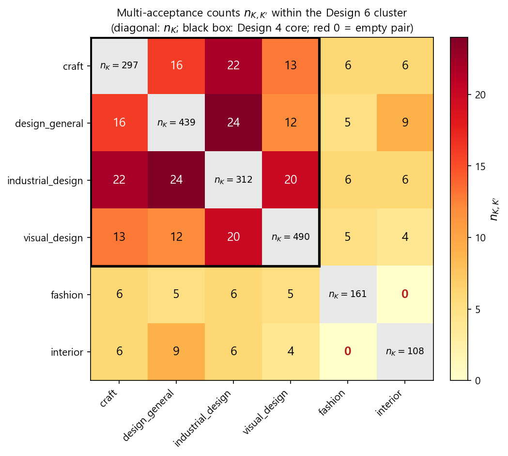

# MIRIP

**합격작만 관측되는 미술대학 입시 데이터에서 학과 간 차이가 서로 다른 비교 단위에서도 반복되는지 분석한 연구입니다.**

## Problem

정량화된 합격 기준이 없는 입시에서 학생 작품이 목표 학과의 합격작 방향과 얼마나 다른지 판단하기 어렵습니다. 또한 selection-only 자료에는 합격작만 남으므로, 학과별 평균 차이를 곧바로 학과의 선호라고 해석할 수 없습니다.

## My Contribution

**Dual-estimator 방법론**을 설계해 서로 다른 관측 단위의 비교를 나란히 수행했습니다.

- **Prototype Estimator:** 학과별 전체 합격작 representation의 평균 차이를 측정합니다.
- **Direct Estimator:** 같은 지원자가 두 학과에 모두 합격한 경우, 지원자 내부의 representation 차이를 측정합니다.
- 두 결과의 방향과 크기 차이를 **Sorting Gap**으로 분석하도록 구성했습니다.

## How It Works

```text
Accepted-work images → frozen DINOv2 embeddings → applicant × department means
                                                   ├─ Prototype contrast
                                                   └─ Direct within-applicant contrast
                                                           ↓
                                                Direction agreement / Sorting Gap
```



*히트맵은 비교 가능한 학과쌍의 표본 구성을 보여주는 자료이며 estimator 결과나 ranking accuracy 자체가 아닙니다.*

## Key Finding / Result

최종 원고의 Design 6에서 비교 가능한 **14개 학과쌍 모두** Prototype과 Direct Estimator가 같은 방향을 보였습니다 (**Sign Concordance 14/14**). 이는 두 추정량 간 방향 일치 결과이지, 정답 라벨에 대한 100% 예측 정확도나 학과 선호의 완전한 복원이 아닙니다.

Design 4 core 6쌍에서는 크기 비율의 median R=2.72, hierarchical bootstrap median R=3.20 (95% CI [2.82, 3.65])로 보고됐습니다. Selection-only 자료만으로 ability selection과 strategic portfolio differentiation을 서로 분리해 식별할 수는 없습니다.

## Prototype

[MIRIP web prototype](https://mirip.vercel.app/) — 프런트엔드 데모 페이지입니다. AI backend는 현재 오프라인이며, 연구 분석 코드와 웹앱은 서로 다른 generation이므로 하나의 운영 시스템으로 간주하지 않습니다.

## Technical Notes

최종 원고 기준 데이터는 4,128개 image embedding rows, 1,024-D frozen DINOv2 ViT-L/14 embeddings, 2,022 applicant-department cells, 9 departments입니다. 원본 그림·지원자 단위 자료·embedding cache는 공개 저장소에 포함하지 않았습니다. 재현 가능한 실행에는 별도 승인된 데이터와 원본 경로 구성이 필요합니다. 상세한 출처·제외 범위는 [`AUDIT_REPORT.md`](AUDIT_REPORT.md)와 [`DATA_RELEASE_POLICY.md`](DATA_RELEASE_POLICY.md)를 참고하세요.
